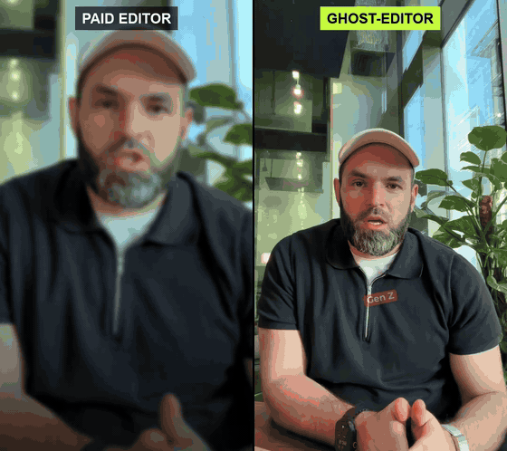

# ghost-editor

**Your AI video editor for talking-head reels.** Give your coding agent (Claude
Code, Codex, any agent that can run a shell) a raw phone recording of someone
talking to camera. You get back a finished vertical reel for Instagram, TikTok or
Shorts:
- the best take of each sentence, with pauses cut
- captions timed to every word that never cover the face
- motion graphics that land on the spoken word
- sound effects and music mixed against the voice

## Paid editor vs ghost-editor

Same raw recording. Left: the cut a paid human editor delivered. Right:
ghost-editor, shown that edit once and asked to cut the raw file the same way.

[](https://github.com/kurbaitaev/ghost-editor/releases/download/v0.1.0/ghost-editor-vs-paid-editor.mp4)

**[Watch the full 49 s side by side, with sound](https://github.com/kurbaitaev/ghost-editor/releases/download/v0.1.0/ghost-editor-vs-paid-editor.mp4)**

## Two ways to get your look

1. **Pick a built-in style.** Say which style (or let the agent choose by the
   speaker's energy). Seven are included:
   - `clean`
   - `editorial`
   - `meme`
   - `cinematic`
   - `launch`
   - `kinetic`
   - `pop`

   Details are [below](#what-it-does). The style keeps your look
   recognisable. The agent varies the scenes, accent colour and music bed
   between reels, so they don't come out identical.
2. **Show it an edit you love** (needs a free [Gemini key](#gemini-api-key-for-two-features)). It reverse-engineers that reel and edits your
   recording the same way (details below). If you like the result, ask the
   agent to save it as a new preset in `styles/` and reuse it by name.

**Reverse-engineering, in detail.** Hand it someone's finished reel (and optionally the raw take). It:
1. reverse-engineers the edit second by second: cuts, zooms, caption style,
   scenes, transitions, sounds, palette and type;
2. maps that onto your recording;
3. renders it.

```
you:   here's my recording, and here's a reel whose editing I love. make mine like that.
agent: studies the reference -> writes the edit plan -> renders -> checks it -> hands you the mp4
```

## What it does

- **Picks takes and cuts pauses.** It transcribes the whole recording and keeps the best take of each sentence. On a single clean take it trims the silences and keeps every word.
- **Seven styles** from one recording:

| style | looks like |
|---|---|
| `clean` | bold captions with the active word in an accent colour, snap zooms, nothing else |
| `editorial` | lowercase blur-in captions, tilted pill tags, full-screen data scenes over the voice |
| `meme` | outline captions, emoji and reactions beside the head, big number cards, punchy sounds |
| `cinematic` | film grade and grain, black-and-white B-roll, keywords in a glowing serif |
| `launch` | dark UI windows with typed prompts, phone chats, glitch cuts |
| `kinetic` | full-screen word-by-word type with a moving camera, the speaker in a round picture-in-picture |
| `pop` | giant words BEHIND the speaker (person cut-out), uppercase captions, colour blocks |

- **Motion scenes on the spoken word:**
  - cursor-click cards
  - glass stat badges
  - 3D word fly-throughs
  - kinetic sentences with a hand-drawn cross-out
  - typed prompts
  - phone chats
  - AI B-roll stills
  - text behind the speaker
- **Captions never cover the face.** A face tracker follows the speaker. Every caption block, card and reaction goes below the chin, else above the head, else shrinks to fit, always inside the platform's safe area (`instagram`, `tiktok`, `shorts`, `all`) and clear of the like/comment buttons. QA reports where every caption landed.
- **Sound that sits under the voice.** Real sound effects are levelled against this speaker's measured voice, not guessed. Density profiles (restrained, standard, rich) and a music bed per style keep the voice readable.
- **New ideas, not a template.** The agent plans each reel from its transcript (what becomes a scene, a card, a sound), so no two reels are the same. The scene and style code is small and documented: ask your agent for a new scene type or a whole new style and it can write one. Three of the seven styles were built that way.
- **Checks its own work.** It runs lint, snapshots every beat before rendering, then after rendering checks loudness, true peak, each sound effect against the voice, and caption placement.

Tested in English and Russian (the bundled fonts cover Latin and Cyrillic).

## Install

```bash
git clone https://github.com/kurbaitaev/ghost-editor ~/.claude/skills/ghost-editor
cd ~/.claude/skills/ghost-editor
bash scripts/doctor.sh                      # checks tools; says how to fix anything missing
python3 scripts/library_restore.py          # downloads the licensed sound effects and music
```

Needs:
- ffmpeg (with libvpx and libass)
- node 18+ (HyperFrames runs through `npx`)
- openai-whisper
- python3 with numpy and opencv-python
- yt-dlp (only for pulling reference videos from a URL)

### Gemini API key (for two features)

Editing in the 7 built-in styles works with no key. Two features need a free Google Gemini key:
- **Show it an edit you love** (reverse-engineering a reference reel)
- **AI B-roll stills**

1. Get a key at [aistudio.google.com/apikey](https://aistudio.google.com/apikey) (Google account, no card for the free tier).
2. `pip install google-genai`
3. Put it where the skill can find it:
   ```bash
   echo 'GEMINI_API_KEY=your-key' > ~/.claude/skills/ghost-editor/.env   # gitignored
   ```
   or `export GEMINI_API_KEY=your-key` in your shell profile.

`doctor.sh` tells you whether it found the key. The scripts check it with one
test call before doing any real work, so a bad key fails fast.

| Agent | Setup |
|---|---|
| **Claude Code** | Clone into `~/.claude/skills/ghost-editor` as above; it shows up as the `ghost-editor` skill. |
| **Codex / agents that read Agent Skills (`SKILL.md`)** | Clone or symlink the folder into that agent's skills directory. |
| **Any other agent** | Tell it: "Follow `<path>/ghost-editor/SKILL.md` to edit this recording." Every step is a plain shell command. |

## Use it

Just ask your agent:

> Edit ~/Downloads/IMG_1234.MOV into a reel in the `launch` style.

> Make my recording look like this reel: ~/Downloads/their-edit.mp4

> Same video, but `cinematic`, and put the captions safe for TikTok.

Under the hood, step by step:

```bash
S=~/.claude/skills/ghost-editor; P=~/reels/my-reel
bash $S/scripts/prep.sh ~/Downloads/IMG_1234.MOV $P             # 1080x1920, voice at -16 LUFS
python3 $S/scripts/transcribe.py $P/assets/talk.mp4 --out $P/build/words.whisper.json
python3 $S/scripts/face_track.py $P/assets/talk.mp4 --out $P/build/face.json
python3 $S/scripts/autocut.py $P/assets/talk.mp4 --noise -30    # single clean take: pause-trimmed takes
# the agent writes $P/reel.json: {"style": "launch", "takes": [...], "beats": [...]}
node $S/scripts/build.mjs $P
cd $P && npx hyperframes lint && npx hyperframes render -o build/reel.mp4
python3 $S/scripts/qa.py $P build/reel.mp4
```

Reverse-engineer a reference edit:

```bash
python3 $S/scripts/reference_study.py ~/Downloads/their-edit.mp4 --out ~/reels/studies/their-edit [--raw ~/Downloads/raw.MOV]
```

It writes a contact sheet, full-resolution frames and a second-by-second edit log
(Gemini 2.5 Pro) mapped onto this skill's beats. The agent checks the log against
the frames before trusting it.

## What's in the box

- `SKILL.md`: the workflow the agent follows, plus the rules learned from getting it wrong.
- `styles/`: the seven presets. `references/styles.md` covers when to use each.
- `examples/gallery/`: one working `reel.json` per style.
- `scripts/`:
  - `build.mjs` (+ `lib/motion.mjs`, `lib/safezone.mjs`): `reel.json` → HyperFrames composition
  - `prep.sh`, `transcribe.py`, `autocut.py`, `face_track.py`
  - `qa.py`, `doctor.sh`
  - `reference_study.py`, `broll_gen.py`
  - `sfx_fetch.py`, `library_restore.py`, `audition.py`
  - `meme_add.py`, `meme_find.py`, `trends.py`: your own meme library
- `references/`: every `reel.json` field and beat type, styles, take selection, sound mixing.

Renders with [HyperFrames](https://www.npmjs.com/package/hyperframes) (HTML + GSAP in headless Chrome).

## Licences

- Code: MIT.
- Sound effects and music: [Mixkit](https://mixkit.co/license/) (free, commercial use, no attribution).
- Fonts: SIL OFL.
- Face model (YuNet): MIT.

`library_restore.py` downloads the media on your machine; none of it is
redistributed in this repo. No memes ship. Add clips you have the rights to with
`scripts/meme_add.py`.

Take selection is adapted from
[mariagorskikh/talking-head-reel](https://github.com/mariagorskikh/talking-head-reel)
(MIT).
