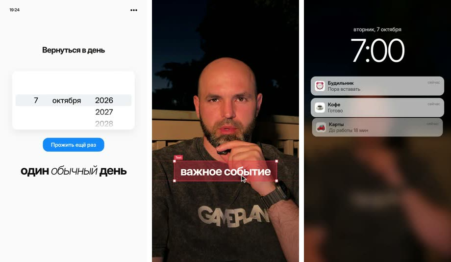
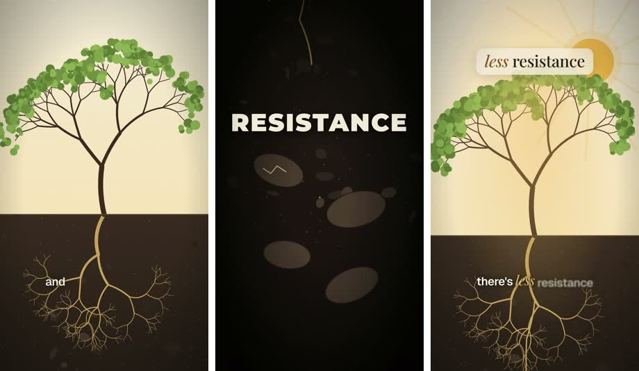
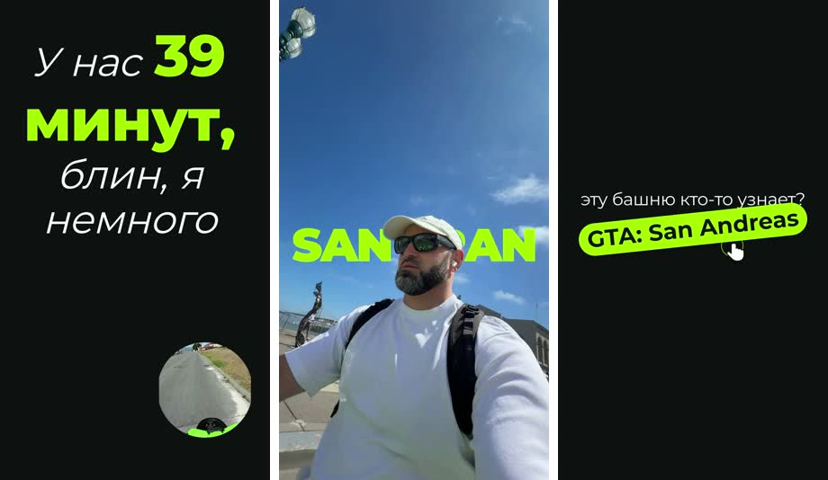

# ghost-editor

**An AI video editor that lives inside your coding agent.**
Send it a raw video of yourself talking to camera. Get back a finished reel for Instagram, TikTok or YouTube Shorts.

## Paid editor vs ghost-editor

Same raw recording. On the left, the edit I paid a human editor for. On the right, ghost-editor after seeing that edit once.

https://github.com/user-attachments/assets/312f6910-a8a0-4424-9dd4-612cd079a2e7

## What it does for you

- **Cuts the mess.** Keeps your best take of each sentence and removes the pauses and false starts.
- **Adds captions** timed to every word, placed so they never cover your face or the app's buttons.
- **Adds motion graphics**: numbers, cards and animated text that pop up right as you say them.
- **Adds sound effects and music**, mixed so your voice always stays clear.
- **Checks its own work** before handing you the video.

## New: three named styles (v0.2)

Ask for them by name. Each one is a full recipe in `recipes/` with its own guide and a worked example.

**Clean OS** · *"edit this in Clean OS"*
An Apple-ad talking head that lives inside your phone: calm word cards that sharpen out of a blur, wide and tight shots from one 4K camera, and an iPhone scene for each thing you name (a date picker, lock-screen notifications, a search with a loading bar stuck at 97%, a Photos memory). A red Figma selection box strikes out the words you reject.

[▶ Watch the Clean OS demo](https://github.com/kurbaitaev/ghost-editor/releases/download/v0.2.0/clean-os-demo.mp4)

**Vector explainer** · *"make an animated explainer"*
No camera needed. A narrator (ElevenLabs) tells the story while a world draws itself: one continuous illustration the camera travels through, serif headlines, words that rise as they're spoken.

[▶ Watch the explainer demo](https://github.com/kurbaitaev/ghost-editor/releases/download/v0.2.0/vector-explainer-demo.mp4)

**POV montage** · *"cut these POV clips into a reel"*
Clips from smart glasses or a GoPro cut into a story: a flash-forward hook, speed-ups, text behind you, a fact card a cursor clicks, and a freeze frame with a record scratch on the moment that matters.

Everything the skill can do, in one page: [docs/PLAYBOOK.md](docs/PLAYBOOK.md).

## Two ways to pick a look

**1. Choose one of 7 styles**

| style | feels like |
|---|---|
| `clean` | bold captions, quick zooms, nothing distracting |
| `editorial` | soft lowercase captions and full-screen stats, like a news explainer |
| `meme` | emoji, reactions and punchy sounds |
| `cinematic` | film look, black-and-white B-roll, elegant type |
| `launch` | app windows and phone chats, made for product launches |
| `kinetic` | big words flying across the screen, you in a small circle |
| `pop` | giant words behind you, bright colour blocks |

**2. Show it a reel you love.** It studies how that video was edited (the cuts, captions, animations and sounds) and edits yours the same way. Like the result? Ask it to save the look as your own style.

## Get started

You need [Claude Code](https://claude.com/claude-code) on a Mac (Linux should work too).

**1. Install.** Paste this into Claude Code:

> Install the ghost-editor skill: clone https://github.com/kurbaitaev/ghost-editor into ~/.claude/skills/ghost-editor and follow its docs/INSTALL.md.

It installs everything it needs and tells you when it's ready (a few minutes).

**2. Edit.** Start a new Claude Code session and say something like:

> Edit ~/Downloads/my-video.mov into a reel in the `pop` style.

> Make my video look like this reel: ~/Downloads/reel-i-love.mp4

> Same video, but `cinematic`, and make it safe for TikTok.

**Want the "show it a reel you love" option?** That part uses Google's Gemini to watch the reference video. Get a free key at [aistudio.google.com/apikey](https://aistudio.google.com/apikey), and Claude Code will ask for it during setup. The 7 styles work without it.

## Questions

**Does it cost anything?** ghost-editor is free and open source. Everything runs on your computer, except the optional Gemini step, which has a free tier that covers occasional use.

**What videos work best?** Vertical phone videos of one person talking to camera. It isn't made for screen recordings.

**Which languages?** Tested in English and Russian.

**Noisy outdoor recording?** It cleans the voice with DeepFilterNet (crickets, hum, wind), set to keep the voice natural.

**Can it make something new?** Yes. Ask for a new style or a new kind of animation and it writes one. Three of the seven presets and all three named styles were made that way.

**Other agents?** It works with Codex and any agent that can run commands. See [INSTALL.md](docs/INSTALL.md).

## Under the hood

Whisper for transcription, OpenCV for face tracking, [HyperFrames](https://www.npmjs.com/package/hyperframes) for rendering, and royalty-free Mixkit sounds and music. Details: [HOW-IT-WORKS.md](docs/HOW-IT-WORKS.md).

---

Built by [@kurbaitaev](https://x.com/kurbaitaev) on X. MIT licence.
